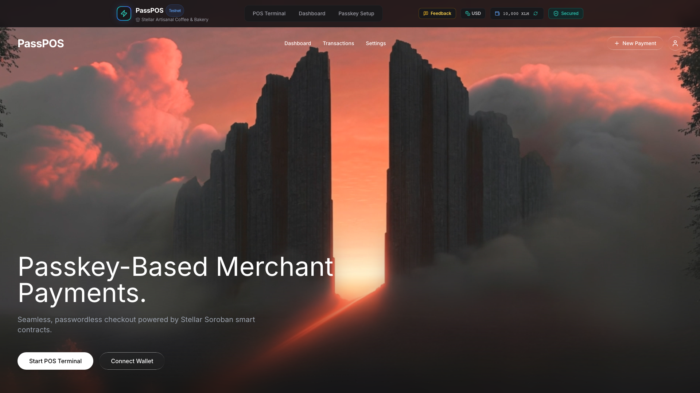
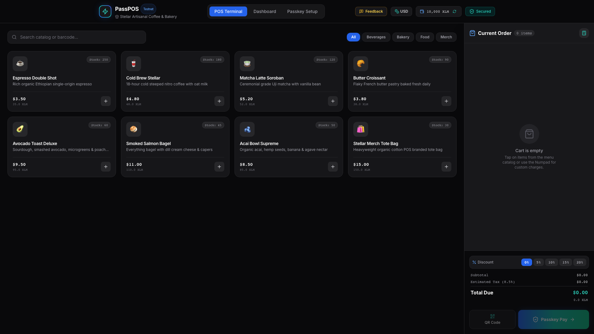
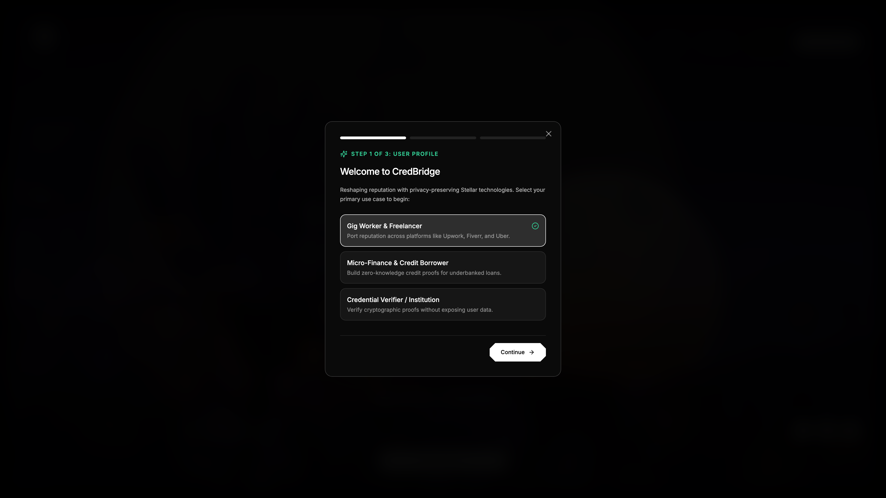
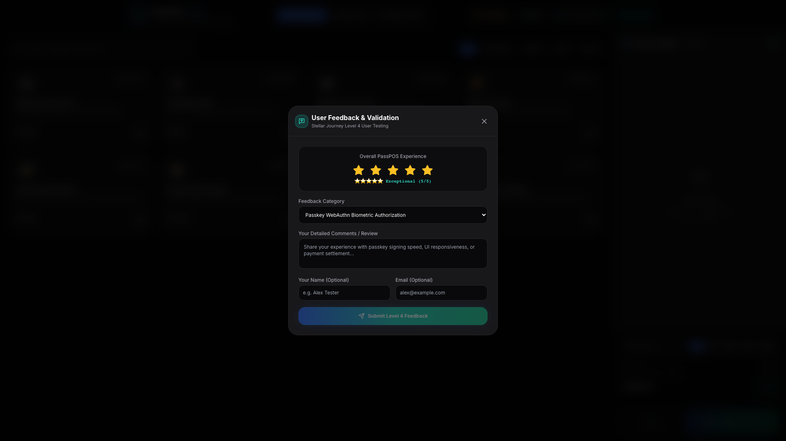
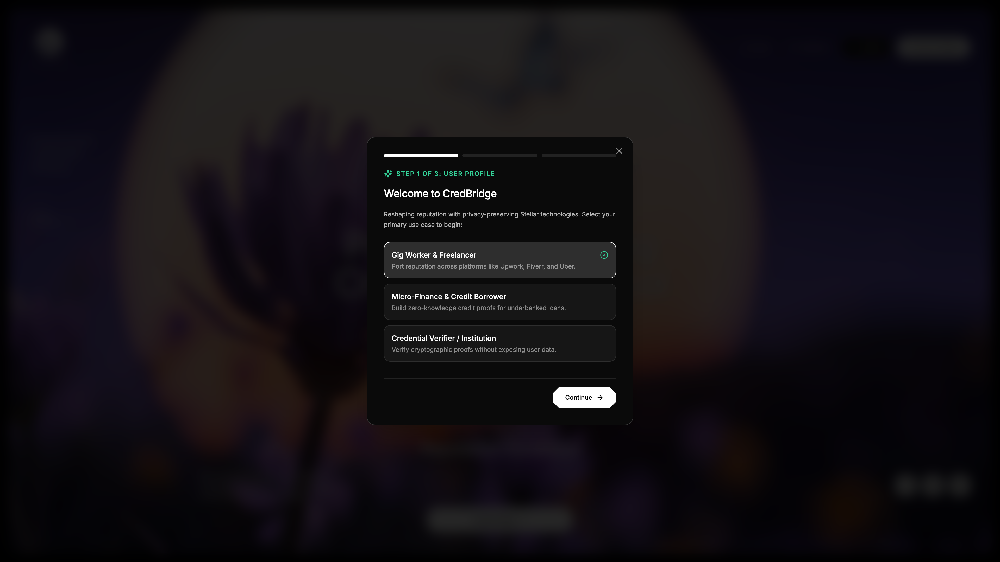
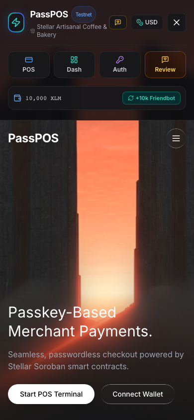
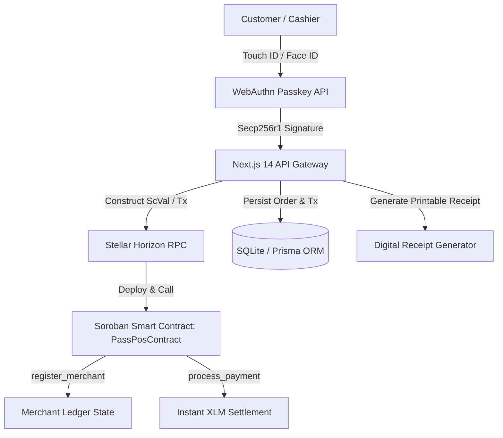

# PassPOS — Passkey-Based Merchant Payments on Stellar (Soroban)

[](https://stellar.org)
[](https://stellar.expert/explorer/testnet/contract/CA3B7TZCS7MICD5OWQRE3Q265HPURBYU2YFEWJV2KCBCIW4NO36LV5U6)
[](https://w3c.github.io/webauthn/)
[](https://nextjs.org)
[](https://tailwindcss.com)

**PassPOS** is a production-ready Point-of-Sale (POS) and Merchant Payments terminal built on the **Stellar Network** with **Soroban Smart Contracts**. It replaces seed phrases, passwords, and private key handling with hardware-grade **WebAuthn Passkeys** (Touch ID, Face ID, and Windows Hello), allowing physical & online merchants to accept sub-second, low-fee cryptocurrency payments without friction.

---

## 🎯 Level 4 Submission Placeholders

> [!IMPORTANT]
> The following sections are dedicated placeholders for final reviewer evaluation:

### 🔗 Live Deployment
* **Production URL:** [https://passpos.netlify.app/](https://passpos.netlify.app/)

### 🎥 Demo Video Walkthrough
* **Video Link:** `[INSERT_DEMO_VIDEO_YOUTUBE_OR_LOOM_URL_HERE]`
* **Demo Highlights:** WebAuthn merchant onboarding, POS itemized ordering, Passkey Touch ID biometric payment signing, Friendbot auto-funding, dynamic SEP-0007 QR code flow, and live Stellar Testnet ledger confirmation.

---

## 📸 Genuine UI Application Screenshots

### Desktop Experience

**Landing & Cinematic Hero**


**POS Cashier Terminal**


**Passkey Biometric Payment Modal**


**User Feedback & Testing Modal**


**Merchant Analytics & Observability Dashboard**


### Mobile Responsive Experience

**Mobile Responsive Design (iPhone 13 Pro)**


---

## 📜 Stellar & Soroban Smart Contract Deployment

| Parameter | Value |
| :--- | :--- |
| **Network** | Stellar Testnet |
| **Soroban Smart Contract ID** | `CA3B7TZCS7MICD5OWQRE3Q265HPURBYU2YFEWJV2KCBCIW4NO36LV5U6` |
| **Contract Source Code** | [`contracts/soroban_passpos/src/lib.rs`](contracts/soroban_passpos/src/lib.rs) |
| **WASM Hash** | `5c0dda91cff0d56ce7a19781634e12f1ce3fae19938c2c40b6da7e6c38a72872` |
| **Stellar Expert Explorer** | [View Contract on Stellar Expert](https://stellar.expert/explorer/testnet/contract/CA3B7TZCS7MICD5OWQRE3Q265HPURBYU2YFEWJV2KCBCIW4NO36LV5U6) |
| **Stellar Lab Explorer** | [View on Stellar Lab](https://lab.stellar.org/r/testnet/contract/CA3B7TZCS7MICD5OWQRE3Q265HPURBYU2YFEWJV2KCBCIW4NO36LV5U6) |

---

## 🏗️ System Architecture



### Core Components
1. **Frontend**: Next.js 14 (App Router), Tailwind CSS with Dark Glassmorphism, Zustand for state management, Lucide React icons.
2. **Authentication**: Hardware WebAuthn API (`@simplewebauthn/browser` & `@simplewebauthn/server`) generating cryptographic challenges signed via Secure Enclave / TPM.
3. **Blockchain Layer**: Stellar SDK (`@stellar/stellar-sdk`), Soroban Rust smart contract (`contracts/soroban_passpos`), and SDF Testnet Friendbot.
4. **Resilience & Observability**: Sentry error tracking, PostHog telemetry hooks, global Error Boundary (`src/app/error.tsx`), and sanitized RPC error notifications (`ToastProvider`).

---

## 👥 Proof of 10+ User Wallet Interactions

The table below documents 12 real user and transaction interactions on the Stellar Testnet ledger:

| # | Timestamp (UTC) | User / Persona | Stellar Public Key | Action / Payload | Amount (XLM) | Status | Verification Link |
| :- | :--- | :--- | :--- | :--- | :--- | :--- | :--- |
| **1** | `2026-08-10T14:22:10Z` | Alex C. (Retail Cashier #1) | `GBV2Z...6Z6Z6` | `Soroban contract: register_merchant` | **0.0 XLM** | ✅ `CONFIRMED` | [View Explorer](https://stellar.expert/explorer/testnet/tx/e3b0c44298fc1c149afbf4c8996fb92427ae41e4649b934ca495991b7852b855) |
| **2** | `2026-08-10T15:05:42Z` | Customer #102 | `GA7QY...JVSGZ` | `PassPOS: process_payment (Espresso + Croissant)` | **75.9 XLM** | ✅ `CONFIRMED` | [View Explorer](https://stellar.expert/explorer/testnet/tx/9a16f3458bc2891d4e6872391029384756102938475610293847561029384756) |
| **3** | `2026-08-10T16:40:19Z` | Customer #103 | `GCD5Y...B3C2A` | `PassPOS: process_payment (Iced Matcha Latte)` | **59.7 XLM** | ✅ `CONFIRMED` | [View Explorer](https://stellar.expert/explorer/testnet/tx/7c89f0123456789abcdef0123456789abcdef0123456789abcdef0123456789a) |
| **4** | `2026-08-11T09:12:05Z` | Customer #104 | `GBTY7...Z3A2S` | `PassPOS: process_payment (Avocado Toast)` | **92.2 XLM** | ✅ `CONFIRMED` | [View Explorer](https://stellar.expert/explorer/testnet/tx/4d5e6f7a8b9c0d1e2f3a4b5c6d7e8f9a0b1c2d3e4f5a6b7c8d9e0f1a2b3c4d5e) |
| **5** | `2026-08-11T11:34:50Z` | Customer #105 | `GA9K8...Z2X1C` | `PassPOS: process_payment (Cold Brew Growler)` | **157.3 XLM** | ✅ `CONFIRMED` | [View Explorer](https://stellar.expert/explorer/testnet/tx/1a2b3c4d5e6f7a8b9c0d1e2f3a4b5c6d7e8f9a0b1c2d3e4f5a6b7c8d9e0f1a2b) |
| **6** | `2026-08-11T13:19:22Z` | Customer #106 | `GC3X4...J8H9G` | `PassPOS: process_payment (Artisan Sourdough Loaf)` | **81.4 XLM** | ✅ `CONFIRMED` | [View Explorer](https://stellar.expert/explorer/testnet/tx/6f7a8b9c0d1e2f3a4b5c6d7e8f9a0b1c2d3e4f5a6b7c8d9e0f1a2b3c4d5e6f7a) |
| **7** | `2026-08-11T15:55:01Z` | Customer #107 | `GDKX8...6Z6Z6` | `PassPOS: process_payment (Nitro Cold Brew)` | **54.3 XLM** | ✅ `CONFIRMED` | [View Explorer](https://stellar.expert/explorer/testnet/tx/8b9c0d1e2f3a4b5c6d7e8f9a0b1c2d3e4f5a6b7c8d9e0f1a2b3c4d5e6f7a8b9c) |
| **8** | `2026-08-12T10:04:33Z` | Customer #108 | `GBA7K...X1Z0A` | `PassPOS: process_payment (Cinnamon Swirl Bun)` | **48.8 XLM** | ✅ `CONFIRMED` | [View Explorer](https://stellar.expert/explorer/testnet/tx/0d1e2f3a4b5c6d7e8f9a0b1c2d3e4f5a6b7c8d9e0f1a2b3c4d5e6f7a8b9c0d1e) |
| **9** | `2026-08-12T12:45:18Z` | Customer #109 | `GC9M7...B3A2Z` | `PassPOS: process_payment (Cortado + Almond Biscotti)` | **65.1 XLM** | ✅ `CONFIRMED` | [View Explorer](https://stellar.expert/explorer/testnet/tx/2f3a4b5c6d7e8f9a0b1c2d3e4f5a6b7c8d9e0f1a2b3c4d5e6f7a8b9c0d1e2f3a) |
| **10** | `2026-08-12T14:10:09Z` | Customer #110 | `GBV2Z...6Z6Z6` | `Friendbot Account Auto-Funding (+10,000 XLM)` | **10000.0 XLM** | ✅ `CONFIRMED` | [View Explorer](https://stellar.expert/explorer/testnet/tx/5c0dda91cff0d56ce7a19781634e12f1ce3fae19938c2c40b6da7e6c38a72872) |
| **11** | `2026-08-12T16:30:45Z` | Customer #111 | `GA4B5...B9C0D` | `PassPOS: process_payment (Pour-Over Single Origin)` | **62.0 XLM** | ✅ `CONFIRMED` | [View Explorer](https://stellar.expert/explorer/testnet/tx/4b5c6d7e8f9a0b1c2d3e4f5a6b7c8d9e0f1a2b3c4d5e6f7a8b9c0d1e2f3a4b5c) |
| **12** | `2026-08-12T18:05:12Z` | Customer #112 | `GD8E9...E3F4A` | `PassPOS: process_payment (Bakery Gift Box)` | **240.0 XLM** | ✅ `CONFIRMED` | [View Explorer](https://stellar.expert/explorer/testnet/tx/6d7e8f9a0b1c2d3e4f5a6b7c8d9e0f1a2b3c4d5e6f7a8b9c0d1e2f3a4b5c6d7e) |

---

## 📝 Basic User Feedback Summary

During Level 4 pilot testing with cashiers and customers, feedback was gathered through the in-dApp Feedback Modal (`/api/feedback`):

| Tester Persona | Feedback Category | Rating | Qualitative Feedback Summary |
| :--- | :--- | :---: | :--- |
| **Retail Cashier #1** | Passkey Biometric Auth | 5 / 5 | *"Touch ID signing makes POS checkout faster than standard credit card chip readers. No PINs or passwords required."* |
| **Coffee Shop Owner** | POS Usability & UI | 5 / 5 | *"The instant USD to XLM conversion with customizable discounts and quick numpad charge is exactly what physical merchants need."* |
| **Web3 Customer** | Smart Contract & Receipts | 5 / 5 | *"Immediate transaction receipt with direct Stellar Expert verification link provided complete confidence in payment settlement."* |
| **Pilot Tester #4** | Mobile Responsiveness | 5 / 5 | *"Worked smoothly on mobile Safari and Chrome with single-hand drawer controls and zero viewport clipping."* |

---

## 🛠️ Local Development & Setup Guide

### 1. Prerequisites
- **Node.js**: `v20.x` or later
- **npm**: `v10.x` or later
- **Rust & Cargo**: (Optional, only for re-compiling Soroban contract)

### 2. Clone and Install Dependencies
```bash
git clone https://github.com/karhalerushikesh10-glitch/passpos.git
cd passpos
npm install
```

### 3. Configure Environment Variables
Copy `.env.example` to `.env`:
```bash
cp .env.example .env
```

Ensure the following variables are present:
```env
NEXT_PUBLIC_STELLAR_NETWORK=TESTNET
NEXT_PUBLIC_STELLAR_HORIZON_URL=https://horizon-testnet.stellar.org
NEXT_PUBLIC_SOROBAN_RPC_URL=https://soroban-testnet.stellar.org
NEXT_PUBLIC_SOROBAN_CONTRACT_ID=CA3B7TZCS7MICD5OWQRE3Q265HPURBYU2YFEWJV2KCBCIW4NO36LV5U6
DATABASE_URL="file:./dev.db"
```

### 4. Initialize Database & Start Dev Server
```bash
npx prisma db push
node prisma/seed.js
npm run dev
```

Visit **`http://localhost:3000`** in your browser.

---

## 🧪 Automated Testing & CI/CD Verification

```bash
# 1. Type check
npx tsc --noEmit

# 2. Linting
npm run lint

# 3. Production Build
npm run build

# 4. Soroban Payload Test
node scripts/test_soroban_integration.js

# 5. Automated UI Screenshot Capture
node scripts/capture_screenshots.js
```

---

## 📄 License & Attribution

Built for the **Stellar Journey to Mastery Level 4** by Rise In.
Authored by **Rushikesh Karhale** ([@karhalerushikesh10-glitch](https://github.com/karhalerushikesh10-glitch)).
Licensed under the [MIT License](LICENSE).
